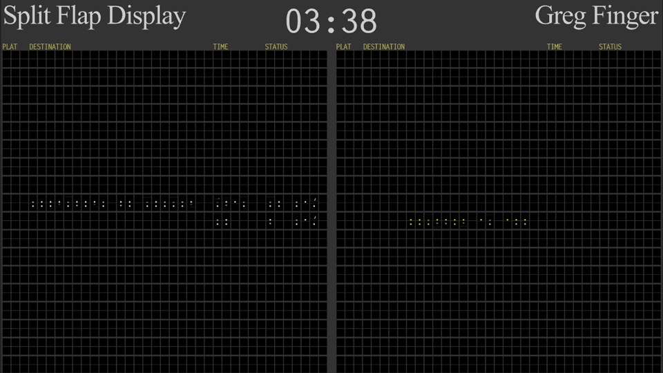
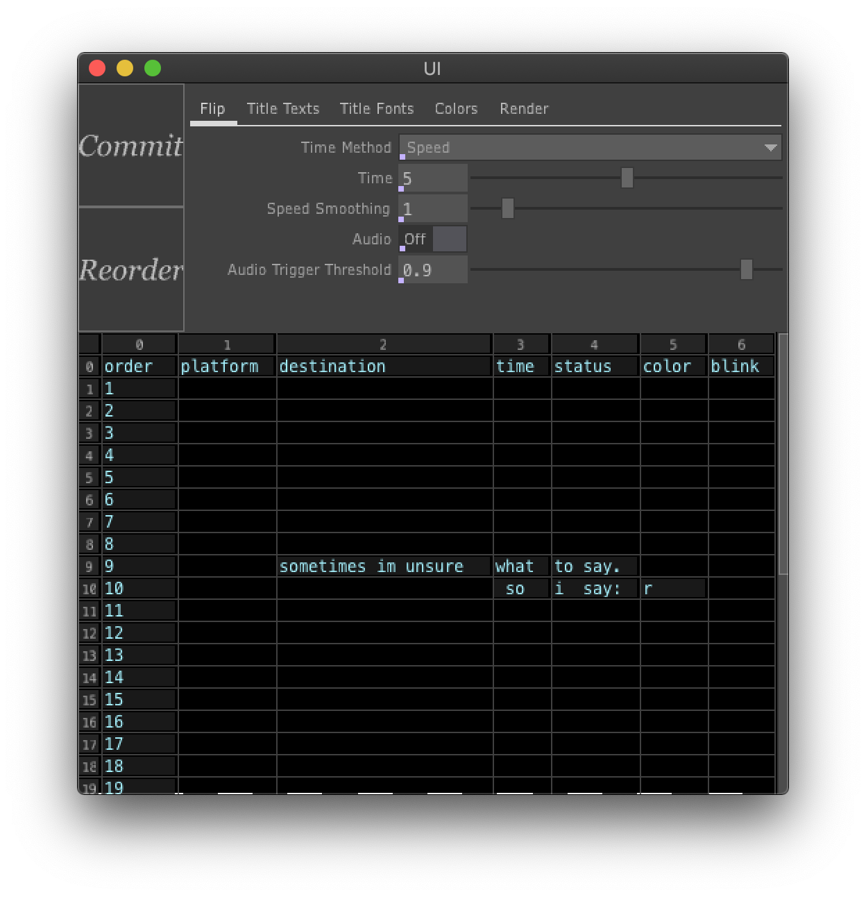

# Split Flap

## UI

### Basic Usage
Enter the data directly into the UI window's table. Accepted characters are: A-Z, 0-9, and special characters: space, colon, forward slash, period.

When finished entering the data you can click the "Commit" button. Each section only allows a certain amount of characters:

Platform: 2, Name: 20, Time: 5, Status: 7

The color section allows characters to show up as white or yellow. Enter w or y respectively to do so.

The order section works with the "Reorder" button. To switch data from one row to another, switch the order numbers. Ex. if you want the data on row eight to appear in row nine, change row eight's order number to 9 and row nine's order number to 8, hit the "Reorder" button and then hit the "Commit" to confirm the change.

### Other Parameters
Flip Speed: The spin velocity of the flaps.

Flip Smoothing: Ease In/Out (acceleration/deceleration) function for the flipping. Real split flaps displays normally don't have this, but it does give the digital version a nice effect visually and helps break up the sound a bit.

Audio: Toggle for turning on/off a clacking sound. I've included the Ableton project with the source files in case the sound needs to be tweaked.

Trigger Threshold: This determines at which part of the spin animation [0 to 1] does the clack sound get triggered.

